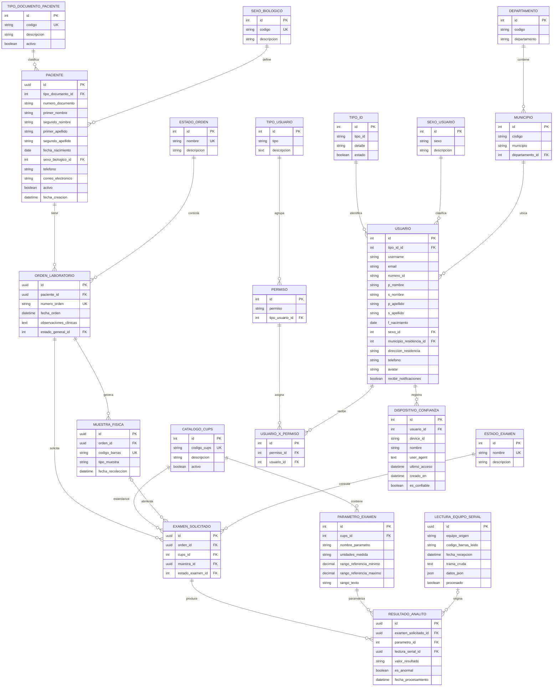

# Diagrama Entidad-Relacion - HealthLab Backend

Este diagrama resume las entidades definidas en los modelos de las aplicaciones laboratorio y usuarios.

Nota: Usuario hereda de AbstractUser de Django. En el diagrama se muestran los campos propios del proyecto y no las tablas internas de autenticacion de Django como auth_group o auth_permission.

## Restricciones relevantes

- Paciente tiene unicidad compuesta en tipo_documento + numero_documento.
- ParametroExamen tiene unicidad compuesta en cups + nombre_parametro.
- ResultadoAnalito tiene unicidad compuesta en examen_solicitado + parametro.
- DispositivoConfianza tiene unicidad compuesta en usuario + device_id.
- ExamenSolicitado puede existir sin muestra asociada porque la FK muestra es nullable.
- ResultadoAnalito puede existir sin lectura serial asociada porque la FK lectura_serial es nullable.

## Lectura rapida del dominio

- El flujo principal de laboratorio es: Paciente -> OrdenLaboratorio -> MuestraFisica / ExamenSolicitado -> ResultadoAnalito.
- CatalogoCups y ParametroExamen modelan el estandar tecnico de cada examen.
- LecturaEquipoSerial representa la entrada cruda desde equipos de laboratorio y puede alimentar resultados.
- El modulo usuarios es administrativo y de autenticacion, separado del flujo clinico.